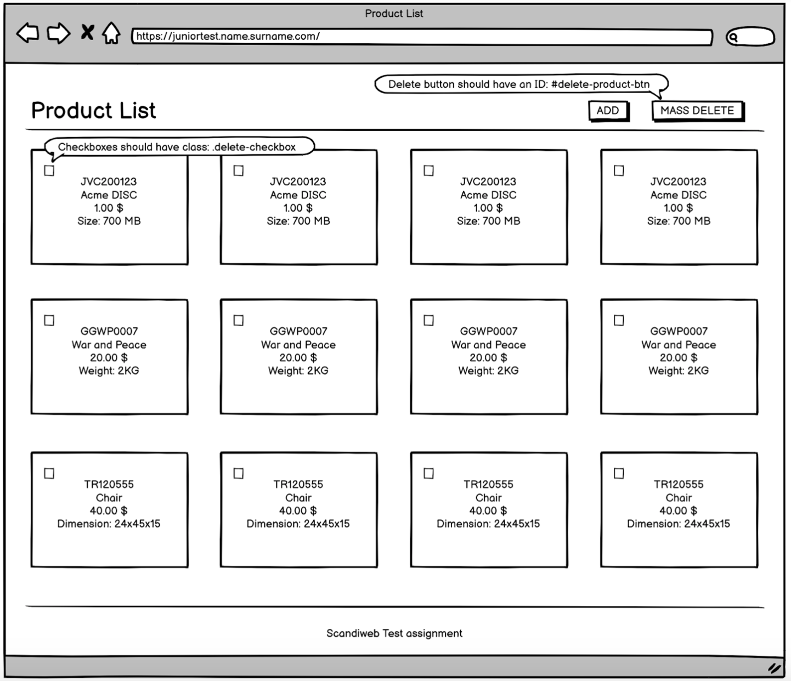
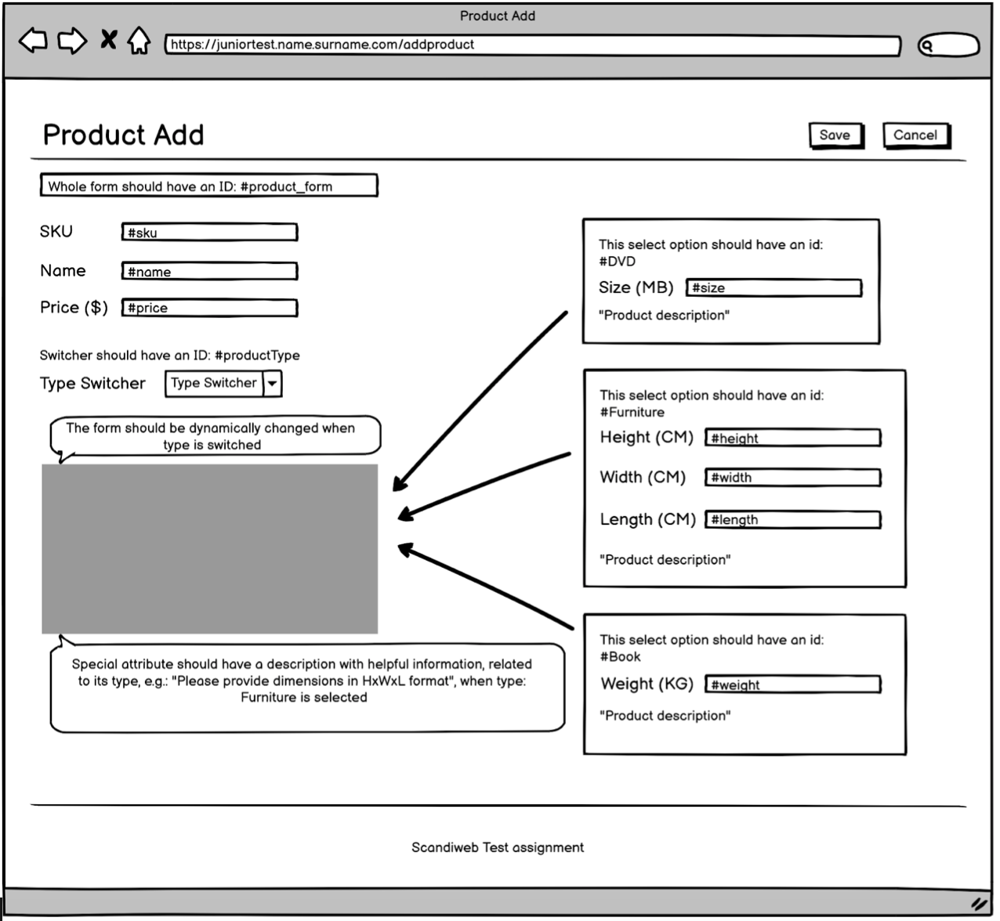

# Junior Developer Test Task

## Welcome to Scandiweb Junior Developer test assignment!

Thank you for your interest and time!

This assignment tests minimum skills and knowledge required to successfully kick start your career at Scandiweb.

The test helps us to assess your level and it helps you to check whether your level is already good to join us as a Junior Developer.

Just like in real work, we have prepared a test automation script to test your work, so you do not need to guess whether you did good or bad. Now you can submit it  to the test automation script (instruction will be provided below) and get your test revision in about 10 seconds!

Please, follow the instructions to make your test compatible with the test automation script and make sure that you score all PASS before you submit it for human evaluation.

## The expected outcome of the test

1. A web-app (accessible by an URL) containing two pages for:
2. Product list page
3. Adding a product page

Have any questions? Please check out our Frequently Asked Questions page!

[Junior Developer FAQ - frequently asked questions](faq.md)

## General coding requirements

These are the listed <ins>mandatory</ins> technical requirements:

- Utilize OOP principles to handle differences in type logic/behavior
  - Procedural PHP code is allowed exclusively to initialize your PHP classes. Rest logic should be placed within class methods.
  - For OOP you would need to demonstrate code structuring in meaningful classes that extend each other, so we would like to see an abstract class for the main product logic. Please take a look at the polymorphism provision.
  - Also, MySQL logic should be handled by objects with properties instead of direct column values. Please use setters and getters for achieving this and don't forget to use them for both save and display logic.
  - Meet PSR standards ([https://www.php-fig.org](https://www.php-fig.org/))
- Avoid using conditional statements for handling differences in product types
  - This means you should avoid any if-else and switch-case statements which are used to handle any difference between products.
- Do not use different endpoints for different products types. There should be 1 general endpoint for product saving
- PHP: ^7.0, plain classes, no frameworks, OOP approach
- jQuery: optional
- jQuery-UI: prohibited
- Bootstrap: optional
- SASS: advantage
- MySQL: ^5.6 obligatory

NOTE:
- React and vue.js is a huge advantage if you decide to use them for the frontend part, but not a requirement

## 1. Product List

This is the first page of the website, so should be accessible by <your\_website>/

Please note, that on product list page product should not be split by product types - they should be sorted by primary key in database.

### MUST HAVE for the list items:

- SKU (unique for each product)
- Name
- Price in $
- One of the product-specific attributes and its value
  - Size (in MB) for DVD-disc
  - Weight (in Kg) for Book
  - Dimensions (HxWxL) for Furniture

### Required UI elements:

- “ADD” button, which would lead to the “Product Add” page
- “MASS DELETE” action, implemented as checkboxes next to each product (should have a class: .delete-checkbox) and a button “MASS DELETE” triggering delete action for the selected products.
- There should be no pagination for the listing, all items should be on the same page
- Do not show any notification messages or alert windows loading the list or after submitting ADD new product dialogue

#### Default view
| Element            | Class            | Text        |
| ------------------ | ---------------- | ----------- |
| Mass Delete button | N (none)         | MASS DELETE |
| Delete Checkbox    | .delete-checkbox | N           |
| Add Product Button | N                | ADD         |

## 2. Adding a product page

This page should open once button "ADD" is pressed, and should be accessible by: <your\_website>/add-product

### The page should display a form with id: #product_form, with the following fields:

- SKU (id: #sku)
- Name (id: #name)
- Price (id: #price)

- Product type switcher (id: #productType) with following options:
  - DVD (can be value or text)
  - Book (can be value or text)
  - Furniture (can be value or text)

- Product type-specific attribute
  - Size input field (in MB) for DVD-disc should have an ID: #size
  - Weight input field (in Kg) for Book should have an ID: #weight
  - Each from Dimensions input fields (HxWxL) for Furniture should have an appropriate ID:
    - Height - #height
    - Width - #width
    - Length - #length

| Element                   | ID            | Text      |
| ------------------------- | ------------- | --------- |
| Product form              | #product_form | N (none)  |
| SKU input field           | #sku          | N         |
| Name input field          | #name         | N         |
| Price input field         | #price        | N         |
| Type switcher             | #productType  | N         |
| DVD option in types       | N             | DVD       |
| Book option in types      | N             | Book      |
| Furniture option in types | N             | Furniture |
| DVD size input field      | #size         | N         |
| Book weight input field   | #weight       | N         |
| Furniture height field    | #height       | N         |
| Furniture width field     | #width        | N         |
| Furniture length field    | #lenght       | N         |
| Save button               | N             | Save      |
| Cancel button             | N             | Cancel    |

### Add product page requirements:

- The form should be dynamically changed when the type is switched
- Special attributes should have a description, related to their type, e.g.: “Please, provide dimensions” / “Please, provide weight” / “Please, provide size” when related product type is selected
- All fields are mandatory for submission, missing values should trigger notification “Please, submit required data”
- Implement input field value validation, invalid data must trigger notification “Please, provide the data of indicated type”
- Notification messages should appear on the same page without reloading
- The page must have a “Save” button to save the product. Once saved, return to the “Product List” page with the new product added.
- The page must have a “Cancel” button to cancel adding the product action. Once canceled, returned to the “Product List” page with no new products added.
- No additional dialogues like “Are you sure you want to Save / Cancel?”

